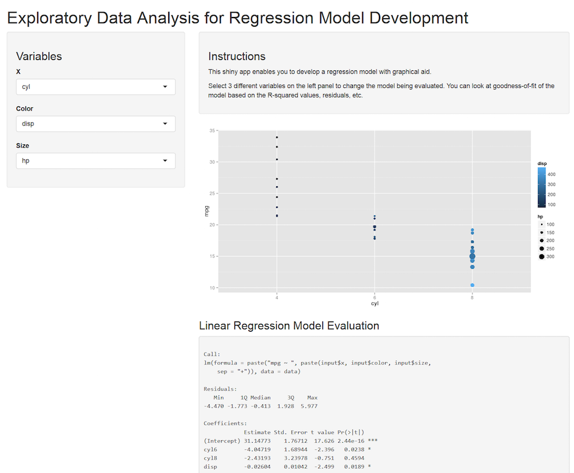

## Data analysis life cycle

1. Formulate question
2. Gather data
3. Exploring data (focus on this app)
4. Develop model to answer question
5. Document steps and analysis for publication

---
## Exploring data

As we are in an era which the amount of data are growing exponentially, exploring data needs to be easier and less tedious. 

Exploring data needs the following skillsets:

1. Data wrangling
2. Data visualisation
  - Programming-based such as MATLAB, Matplotlib (Python), ggplot (R)
  - HTML/CSS/JS such as [D3.js](http://d3js.org)
  - Software like Tableau, etc

---
## App

The [data product app that I have developed](https://kylase-coursera.shinyapps.io/Project/) is a simple data visualisation tool that helps to develop linear model in an agile fashion.

Making use of the `mtcars` data as an example, one can easily manipulate 3 variables (x axis, colour and size of the points on scatter plot) at one to visualise the data to develop regression models.

So you can easily develop a linear regression:
```{r example}
lm(mpg ~ factor(cyl) + hp + wt, data = mtcars)
```

---
## Sample Screenshot of app


